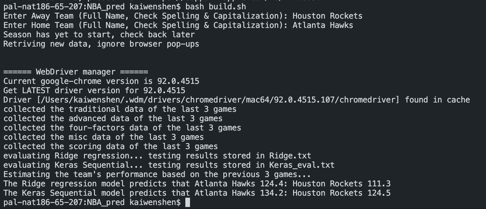

# NBA Prediction
### Project Description
Created growable nba dataset based off nba.com team data (traditional, advanced, four-factors, scoring, and miscellaneous). <br/>
Detailed data categories can be found [here](https://docs.google.com/spreadsheets/d/18lpgq8WEDl_18sI4yYAKv28W4dfhnvu7azEkCGVl_RY/edit?usp=sharing)<br/>
Use both home and away team stats and respective scores in the past to train the model. The prediction is done using team data from the last 3 games.<br/>
Currently implementing user friendly web page adaptation as well as customable prediction data selection feature.<br/>
<br/>
## Execution
Requires Python3.6+ with additional standard packages.
To run prediction, run following terminal command:
```bash
bash build.sh
```
##### Sample Output:

